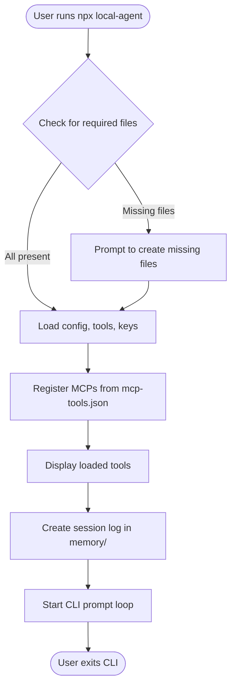

# Agentech System CLI – Architecture Plan

## 1. Platform & Compatibility

- **Primary Runtime:** [Bun](https://bun.sh/) for fast startup and modern JS/TS features.
- **Compatibility:** All code and dependencies must also work with Node.js (npx, tsx, etc.).

## 2. Core Framework

- **Agentic:** Use [`agentic`](https://github.com/transitive-bullshit/agentic) for agent orchestration, prompt management, and MCP tool integration.
- **MCP Tooling:** Leverage agentic’s built-in support for MCP tools ([agentic MCP docs](https://agentic.so/tools/mcp)).

## 3. Default MCP Integrations

- **basic-memory MCP:** 
  - Use [`basic-memory`](https://github.com/basicmachines-co/basic-memory) as a default MCP.
  - Configure it to use the local `memory/` folder for session and memory storage.
- **@modelcontextprotocol/server-filesystem MCP:**
  - Include and auto-configure with access to the current working directory (the scope of the running application).
- **Extensibility:** Additional MCPs can be declared in `mcp-tools.json`.
- **Default MCPs in mcp-tools.json:** The default MCPs (`basic-memory` and `@modelcontextprotocol/server-filesystem`) must be present in `mcp-tools.json`. If they are missing, the loader will inject them automatically to ensure baseline functionality.

## 4. File/Folder Structure

```
/agentech-system/
  ├── system.md
  ├── local-agent.json
  ├── mcp-tools.json
  ├── keys.json
  ├── memory/
  └── [cli.ts|cli.js]
```

## 5. Startup & Flow

- On launch, check for required files.
- If missing, prompt to create (empty or template).
- Load system, config, tools, and keys.
- Register default MCPs (basic-memory, server-filesystem) and any in mcp-tools.json.
- Display loaded tools, enter prompt loop.
- Log all interactions in `memory/` (markdown, session-based).
- Handle tool approval/authorization as needed.

## 6. Frameworks & Libraries

- **CLI:** `commander`, `yargs`, or Bun’s built-in CLI helpers.
- **Agentic:** For agent orchestration and MCP.
- **basic-memory:** For memory MCP.
- **@modelcontextprotocol/server-filesystem:** For filesystem MCP.
- **fs/promises:** For file operations (Bun and Node compatible).
- **readline/enquirer:** For prompt loop (Bun and Node compatible).

## 7. Extensibility

- Users can add more MCPs via `mcp-tools.json`.
- Future: Tool search, advanced memory, custom LLMs, etc.

## 8. High-Level Architecture Diagram

```mermaid
flowchart TD
    Start([Start CLI])
    CheckFiles{Check for system.md, local-agent.json, mcp-tools.json, keys.json}
    PromptCreate[Prompt user to create missing files]
    LoadFiles[Load system, config, tools, keys]
    RegisterMCPs[Register default MCPs (basic-memory, server-filesystem) + mcp-tools.json MCPs]
    CheckKeys{Keys present?}
    PromptKey[Prompt user to provide API key]
    Ready[Display loaded tools, show "Ready"]
    UserPrompt[Wait for user prompt]
    SendToAgentic[Send prompt to agentic agent (system, config, tools)]
    AgenticResponse[Receive agentic/LLM response]
    ToolApproval{Tool requires approval?}
    PromptApproval[Prompt user for approval]
    LogMemory[Log interaction to memory/session file]
    LoopBack[Loop for next prompt]
    End([Exit, finalize session log])

    Start --> CheckFiles
    CheckFiles -- All present --> LoadFiles
    CheckFiles -- Missing files --> PromptCreate --> LoadFiles
    LoadFiles --> RegisterMCPs
    RegisterMCPs --> CheckKeys
    CheckKeys -- No --> PromptKey --> RegisterMCPs
    CheckKeys -- Yes --> Ready
    Ready --> UserPrompt
    UserPrompt --> SendToAgentic
    SendToAgentic --> AgenticResponse
    AgenticResponse --> ToolApproval
    ToolApproval -- Yes --> PromptApproval --> LogMemory
    ToolApproval -- No --> LogMemory
    LogMemory --> LoopBack
    LoopBack --> UserPrompt
    UserPrompt -- User exits --> End
```

## 9. References

- [agentic](https://github.com/transitive-bullshit/agentic)
- [basic-memory](https://github.com/basicmachines-co/basic-memory)
- [@modelcontextprotocol/server-filesystem](https://github.com/modelcontextprotocol/server-filesystem)
- [agentic MCP tools](https://agentic.so/tools/mcp)
- [Bun](https://bun.sh/)

---

## 10. Release Process

### Goals

- Users can run `npx local-agent` in any folder to initialize or restart the CLI agent.
- All required files and folders are created or checked on first run.
- The CLI is published to npm as `local-agent`.

### Steps

1. **Prepare for Release**
   - Ensure `package.json` has a `bin` entry for the CLI (e.g., `"bin": { "local-agent": "./cli.js" }`).
   - Ensure all dependencies are listed and compatible with both Node.js and Bun.
   - Add a postinstall script if any build steps are needed.

2. **Testing**
   - Test running `npx local-agent` in a fresh folder:
     - Should prompt to create missing files.
     - Should initialize `memory/` and required config files.
     - Should load default and custom MCPs.
     - Should start the prompt loop and log sessions.

3. **Documentation**
   - Update `README.md` with usage instructions:
     - How to install globally or use with `npx`.
     - How to add custom MCPs via `mcp-tools.json`.
     - How to reset or re-initialize a folder.

4. **Publish**
   - Run `npm publish` to publish the CLI to npm as `local-agent`.

5. **Post-Release**
   - Monitor for issues.
   - Encourage users to report bugs or suggest features.

### Initialization & Usage Flow

