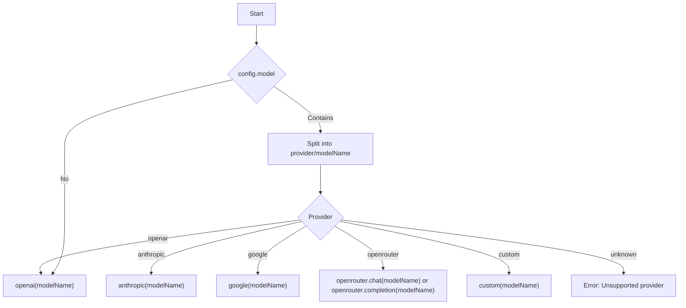

# AI Client Provider Refactor Design Document

## Motivation

The current implementation of the application only supports OpenAI as the language model provider. However, the `@ai-sdk` ecosystem supports multiple providers (Anthropic, Google, OpenRouter, Mistral, Llama, etc.), and the application should be able to select the appropriate client dynamically based on configuration. This will enable users to leverage a wider range of models and providers without code changes.

## Requirements

- The application must support selecting the AI client/provider at runtime based on a configuration value.
- The configuration will specify the model as a string in the format: `provider/model`, e.g.:
  - `openai/gpt-4o-mini`
  - `anthropic/claude-3-5-sonnet-latest`
  - `google/models/gemini-2.0-flash-exp`
  - `openrouter/meta-llama/llama-3.1-405b-instruct`
  - `custom/model-id`
- The code must parse this string, select the correct client, and pass the model name to the client function.
- The solution must be extensible to support new providers in the future.
- The solution must maintain backward compatibility where possible.
- The solution must be documented for maintainers and users.

## Design

### High-Level Approach

1. **Model String Parsing**  
   - Split the `config.model` string on `/` to extract the provider/client and the model name.
   - Example: `openai/gpt-4o-mini` → provider: `openai`, model: `gpt-4o-mini`.

2. **Dynamic Client Selection**  
   - Map provider names to their respective client import/functions.
   - Example mapping:
     - `openai` → `openai` from `@ai-sdk/openai`
     - `anthropic` → `anthropic` from `@ai-sdk/anthropic`
     - `google` → `google` from `@ai-sdk/google`
     - `openrouter` → `openrouter` from `@openrouter/ai-sdk-provider`
     - `custom` → `custom` from `@ai-sdk/custom`
   - For OpenRouter, the model name may include a further namespace (e.g., `openrouter/meta-llama/llama-3.1-405b-instruct`).

3. **Refactored Model Selection Logic**  
   - Replace the hardcoded `openai(config.model)` with a function that:
     - Parses the provider and model.
     - Selects the correct client.
     - Calls the client with the model name.
   - Example:
     ```ts
     const { provider, modelName } = parseModelString(config.model);
     const client = getClientForProvider(provider);
     const model = client(modelName);
     ```

4. **Imports and Dependency Management**  
   - Import all supported clients at the top of the file.
   - Optionally, use dynamic imports if tree-shaking or bundle size is a concern.

5. **Configuration and Validation**  
   - Update documentation to specify the new model string format.
   - Optionally, validate the provider and model at runtime and provide helpful error messages.

6. **Backward Compatibility**  
   - If the model string does not contain a `/`, default to OpenAI for backward compatibility.

### Example Usage

```ts
// config.model = "anthropic/claude-3-5-sonnet-latest"
const { provider, modelName } = parseModelString(config.model);
const client = getClientForProvider(provider);
const model = client(modelName);

const result = await generateText({
  model,
  tools: allTools,
  temperature: config.temperature,
  system: enhancedSystemPrompt,
  prompt: contextualPrompt
});
```

### Mermaid Diagram



### Affected Files

- [`interactions.ts`](interactions.ts): Main logic for model selection and invocation.
- Configuration documentation (README, config files): Update to describe new model string format.

### Migration and Compatibility

- Existing configs using only the model name (e.g., `gpt-4o-mini`) will default to OpenAI for backward compatibility.
- Users should update their configs to use the new format for non-OpenAI providers.
- Document the change and provide examples for all supported providers.
- Update Readme File with the new feature definition.

### Open Questions

- Should dynamic imports be used for clients to reduce bundle size? 
* Yes dynamic imports should be use when possible.
- Should the provider mapping be extensible via plugin or config?
 * the provider mapping should be only config.

## References

- [ai-sdk documentation](https://ai-sdk.dev/docs/introduction)
- Example code snippets from user prompt.